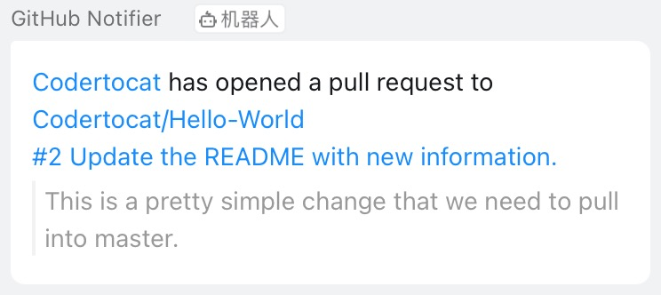

# GitHub to DingTask

An implementation of webhook used to notify GitHub repository events to DingTalk.

[中文](#中文)|[英文](#English)

## 中文

### 开始吧

此程序可使用阿里云函数计算服务（FC），该服务提供URL可被GitHub仓库WebHook所使用。 由于FC每月有100万次的免费调用额度，所以无需担心费用问题。

首次使用请按如下步骤准备：

- [安装Serverless Devs](https://help.aliyun.com/document_detail/195474.html) ，该工具用于部署服务和函数。
- [配置Serverless Devs](https://help.aliyun.com/document_detail/295894.html) ，选择Alibaba Cloud
  provider进行配置。
- 在钉钉群中添加自定义机器人，安全设置选择为"加签"，获取WebHook和密钥。
- 用上一步获取到的内容分别替换`notification/conf.py`中的`webhook`和`secret`变量的值。
- 部署此程序：

```shell
$ s github-notification deploy
```

- 访问 [FC控制台](https://fcnext.console.aliyun.com/cn-beijing/services/github-notification/function-detail/dingtalk/LATEST?tab=trigger)
获取公网访问地址，将之作为GitHub仓库的WebHook。

### 支持的[WebHook事件](https://docs.github.com/en/developers/webhooks-and-events/webhooks/webhook-events-and-payloads)

- discussion/discussion_comment
- fork
- issue_comment/issues
- pull_request/pull_request_review/pull_request_review_comment
- push
- star

### 截图


### 许可

[MIT](LICENSE)

## English

### Getting Started

This program can be used in Alibaba Cloud Function Computing Service(FC), which provides url for
GitHub repository webhook to use. There is no need to worry about incurring charges, because FC has
1 million free calls per month.

The following steps need to be prepared for the first use:

- [Install Serverless Devs](https://www.alibabacloud.com/help/doc-detail/195474.html), this tool is
  used to deploy services and functions.
- [Configure Serverless Devs](https://www.alibabacloud.com/help/doc-detail/295894.html)
  for Alibaba Cloud provider.
- Add a custom robot to DingTalk Group, select "Signature" as the security setting, and obtain the
  WebHook and secret key.
- Replace the values ​​of the `webhook` and `secret` variables in `notification/conf.py` with the
  content obtained in the previous step.
- Deploy the program:

```shell
$ s github-notification deploy
```

- Visit the [FC console](https://fcnext.console.aliyun.com/cn-beijing/services/github-notification/function-detail/dingtalk/LATEST?tab=trigger)
  to obtain the public network access address, and use it as the WebHook of the GitHub repository.

### Supported [WebHook events](https://docs.github.com/en/developers/webhooks-and-events/webhooks/webhook-events-and-payloads)

- discussion/discussion_comment
- fork
- issue_comment/issues
- pull_request/pull_request_review/pull_request_review_comment
- push
- star

### Snapshot


### License

[MIT](LICENSE)
