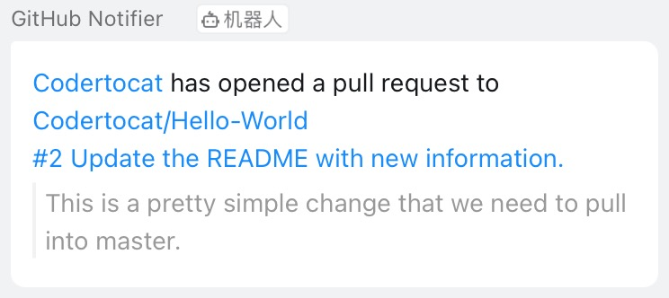

# GitHub to DingTalk

Forward GitHub webhook events to DingTalk group chat.

[中文文档](README_zh.md)

## Features

- Route different events to different DingTalk groups
- Support `event.action` routing (e.g., `release.published`)
- YAML-based configuration with multi-group support
- Deploy to Alibaba Cloud Function Compute

## Quick Start

1. Install [uv](https://docs.astral.sh/uv/) and dependencies:

```shell
make install
```

2. Create `config.yml` (see [config.example.yml](config.example.yml)):

```yaml
dingtalk_groups:
  dev-group:
    webhook: "https://oapi.dingtalk.com/robot/send?access_token=YOUR_TOKEN"
    secret: "YOUR_SECRET"
  release-group:
    webhook: "https://oapi.dingtalk.com/robot/send?access_token=YOUR_TOKEN"
    secret: "YOUR_SECRET"

routes:
  - repo: "myorg/my-repo"
    events: ["issues", "pull_request", "push"]
    groups: ["dev-group"]
  - repo: "myorg/my-repo"
    events: ["release.released"]
    groups: ["release-group"]

# default_group: "dev-group"
```

3. Install [Serverless Devs](https://docs.serverless-devs.com/) (`s` CLI) and deploy to Alibaba Cloud FC:

```shell
make deploy
```

4. Use the FC public URL as your GitHub repository's webhook URL.

## Development

```shell
make dev       # Dev server with hot reload
make test      # Run tests
make lint      # Linting & type checking
make format    # Format code
```

## Screenshot



## License

[MIT](LICENSE)
